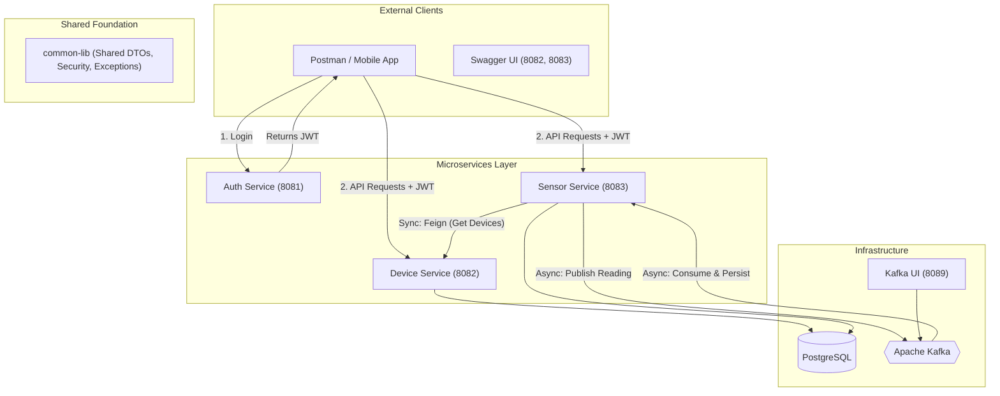

# Sensor Monitoring Microservices: Architecture & Setup Guide

## 1. High-Level Architecture Diagram

The following diagram illustrates the interaction between microservices, infrastructure, and the shared library.



---

## 2. Component Descriptions

### **A. auth-service (Port 8081)**
*   **Role**: Identity Provider.
*   **Responsibility**: Authenticates demo credentials (`admin/admin123`) and issues signed JWT tokens.
*   **Dependencies**: `common-lib` (for `JwtUtil`).

### **B. device-service (Port 8082)**
*   **Role**: Inventory Manager.
*   **Responsibility**: Manages the registry of physical sensor devices (CRUD operations).
*   **Data**: Stores device metadata in the `devices` table.
*   **Security**: Requires JWT for mutations; allows internal GET access for simulation.

### **C. sensor-service (Port 8083)**
*   **Role**: Data Processor & Orchestrator.
*   **Responsibility**: 
    *   **Simulation**: A scheduler polls `device-service` via Feign Client every 10s to fetch active devices.
    *   **Kafka Producer**: Generates temperature data and sends it to `sensor-readings` topic.
    *   **Kafka Consumer**: Listens to the topic and persists every reading into the `sensor_readings` table.
    *   **Alerting**: Detects critical temperatures and publishes to `sensor-alerts` topic.

### **D. common-lib (Shared Module)**
*   **Role**: Cross-cutting Concerns.
*   **Responsibility**: Contains logic shared across all services:
    *   **Security**: `JwtAuthenticationFilter` and `RateLimitingFilter`.
    *   **DTOs**: `SensorEvent` and `AlertLevel`.
    *   **Exceptions**: `GlobalExceptionHandler` and custom Resource exceptions.

---

## 3. Communication Patterns

| Pattern | Type | implementation | Purpose |
| :--- | :--- | :--- | :--- |
| **Request/Response** | Synchronous | **OpenFeign** | `sensor-service` fetching the device list from `device-service`. |
| **Event-Driven** | Asynchronous | **Kafka** | Decoupling the generation of sensor data from the persistence logic. |
| **Security** | Shared Filter | **JWT** | Every request is validated against the secret key defined in `common-lib`. |

---

## 4. Complete Setup Instructions

### **Prerequisites**
*   **Docker Desktop** installed and running.
*   **Internet Connection** (to download Maven dependencies inside Docker).
*   *Note: You do NOT need Java or Maven installed locally; Docker handles the build.*

### **Step 1: Clean Start**
Ensure no old containers or volumes are conflicting:
```bash
docker compose down -v
```

### **Step 2: Build and Run**
This will trigger the multi-stage build (Compiling code -> Running tests -> Packaging JAR -> Containerizing):
```bash
docker compose up --build -d
```

### **Step 3: Verify Startup**
Check if all services are healthy:
```bash
docker compose ps
```

---

## 5. Testing the Flow

### **1. Get a Token**
*   **URL**: `POST http://localhost:8081/api/v1/auth/login`
*   **Body**: `{"username": "admin", "password": "admin123"}`
*   **Action**: Copy the returned `token`.

### **2. Register a Device**
*   **URL**: `http://localhost:8082/swagger-ui.html`
*   **Action**: Click **Authorize**, paste the token, and use the `POST /api/v1/devices` endpoint to create a device with code `DEV-001`.

### **3. Observe Automation**
*   Within 10 seconds, the `sensor-service` will fetch `DEV-001` and start producing Kafka messages.
*   **View Kafka**: Open `http://localhost:8089` to see the live messages.
*   **View Data**: Go to `http://localhost:8083/swagger-ui.html` and call `GET /api/v1/sensors/readings`.

### **4. Rate Limiting**
*   Try hitting any API more than 20 times in one second; you will receive a `429 Too Many Requests` error, demonstrating the shared security filter.
