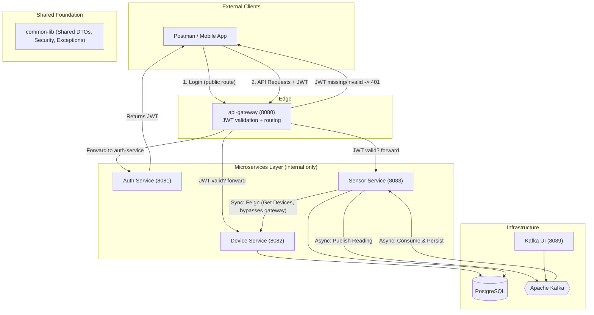

# Sensor Monitoring Microservices: Architecture & Setup Guide

## 1. High-Level Architecture Diagram

The following diagram illustrates the interaction between microservices, infrastructure, and the shared library.



---

## 2. Component Descriptions

### **api-gateway (Port 8080) - the only externally published service**
*   **Role**: Edge / API Gateway.
*   **Responsibility**: The single entry point for every client request. Built with Spring Cloud Gateway (reactive WebFlux).
    *   **Authentication gate**: a global `JwtAuthenticationFilter` runs before any routing logic. It rejects any request without a valid `Authorization: Bearer <token>` with `401`, except for the explicitly whitelisted public paths (`/api/v1/auth/**`, health checks).
    *   **Routing**: forwards `/api/v1/auth/**` to auth-service, `/api/v1/devices/**` to device-service, `/api/v1/sensors/**` to sensor-service.
    *   **Identity propagation**: on a valid token, attaches `X-Authenticated-User` to the forwarded request so downstream services know who's calling without re-parsing the JWT.
*   **Dependencies**: none of the app modules - it intentionally avoids `common-lib` (which is Servlet-based) since Spring Cloud Gateway requires the reactive stack. It has its own minimal, framework-agnostic `JwtUtil` that shares the same signing secret.

### **A. auth-service (internal, Port 8081)**
*   **Role**: Identity Provider.
*   **Responsibility**: Authenticates demo credentials (`admin/admin123`) and issues signed JWT tokens.
*   **Dependencies**: `common-lib` (for `JwtUtil`).
*   **Reachability**: only from `api-gateway` and other containers on the docker network - no longer published to the host.

### **B. device-service (internal, Port 8082)**
*   **Role**: Inventory Manager.
*   **Responsibility**: Manages the registry of physical sensor devices (CRUD operations).
*   **Data**: Stores device metadata in the `devices` table.
*   **Security**: Requires JWT for mutations; allows internal GET access for simulation (used by sensor-service's Feign client, which talks to it directly rather than through the gateway).
*   **Reachability**: only from `api-gateway` and other containers on the docker network.

### **C. sensor-service (internal, Port 8083)**
*   **Role**: Data Processor & Orchestrator.
*   **Responsibility**: 
    *   **Simulation**: A scheduler polls `device-service` via Feign Client every 10s to fetch active devices.
    *   **Kafka Producer**: Generates temperature data and sends it to `sensor-readings` topic.
    *   **Kafka Consumer**: Listens to the topic and persists every reading into the `sensor_readings` table.
    *   **Alerting**: Detects critical temperatures and publishes to `sensor-alerts` topic.
*   **Reachability**: only from `api-gateway` and other containers on the docker network.

### **D. common-lib (Shared Module)**
*   **Role**: Cross-cutting Concerns for auth/device/sensor-service.
*   **Responsibility**: Contains logic shared across those three services:
    *   **Security**: `JwtAuthenticationFilter` and `RateLimitingFilter`.
    *   **DTOs**: `SensorEvent` and `AlertLevel`.
    *   **Exceptions**: `GlobalExceptionHandler` and custom Resource exceptions.
*   **Note**: `api-gateway` does NOT depend on this module (see above) - it has its own lightweight JWT validator instead.

---

## 3. Communication Patterns

| Pattern | Type | implementation | Purpose |
| :--- | :--- | :--- | :--- |
| **Edge Auth** | Synchronous | **Spring Cloud Gateway Global Filter** | Every external client request is authenticated at `api-gateway` before being routed anywhere. |
| **Request/Response** | Synchronous | **OpenFeign** | `sensor-service` fetching the device list from `device-service` directly (internal, bypasses the gateway). |
| **Event-Driven** | Asynchronous | **Kafka** | Decoupling the generation of sensor data from the persistence logic. |
| **Defense in Depth** | Shared Filter | **JWT (common-lib)** | Each downstream service still validates the JWT itself too, in case it's ever reached outside the gateway. |

---

## 4. Complete Setup Instructions

### **Prerequisites**
*   **Docker Desktop** installed and running.
*   **Internet Connection** (to download Maven dependencies inside Docker).
*   *Note: You do NOT need Java or Maven installed locally; Docker handles the build.*

### **Step 1: Clean Start**
Ensure no old containers or volumes are conflicting:
```bash
docker compose down -v
```

### **Step 2: Build and Run**
This will trigger the multi-stage build (Compiling code -> Running tests -> Packaging JAR -> Containerizing), now including `api-gateway`:
```bash
docker compose up --build -d
```

### **Step 3: Verify Startup**
Check if all services are healthy:
```bash
docker compose ps
```

---

## 5. Testing the Flow

All of the following go through the gateway on port **8080** - `auth-service`, `device-service`, and `sensor-service` no longer have ports published to the host.

### **1. Get a Token**
*   **URL**: `POST http://localhost:8080/api/v1/auth/login`
*   **Body**: `{"username": "admin", "password": "admin123"}`
*   **Action**: Copy the returned `token`.

### **2. Register a Device**
*   **URL**: `POST http://localhost:8080/api/v1/devices`
*   **Header**: `Authorization: Bearer <token>`
*   **Action**: Create a device with code `DEV-001`. (Try the same call without the header - you'll get `401` straight from the gateway.)

### **3. Observe Automation**
*   Within 10 seconds, the `sensor-service` will fetch `DEV-001` (directly from `device-service`, not through the gateway) and start producing Kafka messages.
*   **View Kafka**: Open `http://localhost:8089` to see the live messages.
*   **View Data**: `GET http://localhost:8080/api/v1/sensors/readings` with the same bearer token.

### **4. Rate Limiting**
*   Try hitting any API more than 20 times in one second; you will receive a `429 Too Many Requests` error from the downstream service's shared security filter (the gateway forwards the real client IP via `X-Forwarded-For` so this still works correctly per-client).

### **5. Swagger UI**
*   Since `device-service` and `sensor-service` are no longer published to the host, their Swagger UIs aren't reachable at `localhost:808x/swagger-ui.html` anymore. For local debugging, you can still run an individual service directly with `mvn spring-boot:run` outside Docker, or temporarily add a `ports:` mapping back in `docker-compose.yml`.

